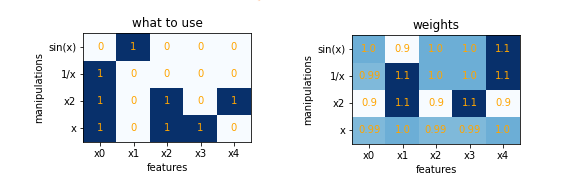

### Случайный поиск с адаптацией (Random Search)

Алгоритм для поиска наиболее информативных признаков и манипуляций над признаками, повышающими качество модели.

В отличие от генетического алгоритма матрица "признак - манипуляции" заполняется весами (вероятности выбора).
Признаки и манипуляции выбираются случайно. Если качество модели с данным выбором снизилось, то веса использованных признаков и манипуляций уменьшаются (снижается вероятность их выбора). Если же качество модели возросло - веса увеличиваются. 

Пример.

- На первом шаге матрицу модификации признаков заполняют единичными весами, это обеспечивает равновероятный выбор.
- Случайным образом выбирается несколько признаков и манипуляций. На рис. выбор отмечен 1.

 - В соответствии с выбором создаются данные, обучается модель, определяется качество скользящим контролем.

По данным признакам получено качество 0.7378
Поскольку это была первая итерация, веса использованных признаков не меняются. А полученное качество используется для сравнения в следующей итерации.

- Случайным образом выбирается несколько признаков и манипуляций. Создаются данные, обучается модель. 

Качество скользящим контролем выросло до 0.7573. Веса использованных признаков и манипуляций увеличиваем.

- Случайным образом выбирается несколько признаков и манипуляций. Создаются данные, обучается модель.
Качество упало по сравнению с предыдущим шагом до 0.7373, а значит используемым признакам уменьшаем веса - вероятности выбора.

Правила остановки:
- число итераций
- желаемое качество (desired score)